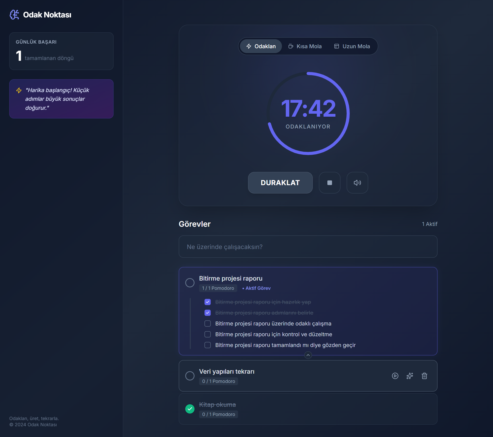
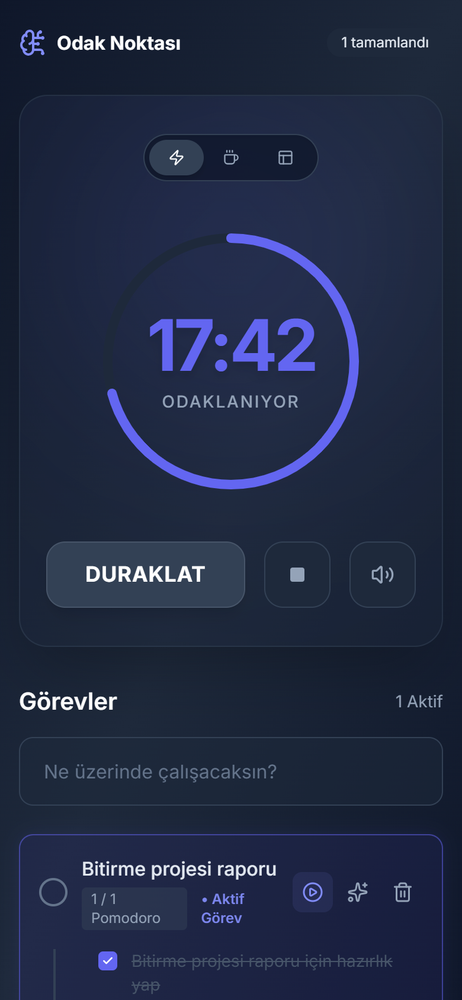
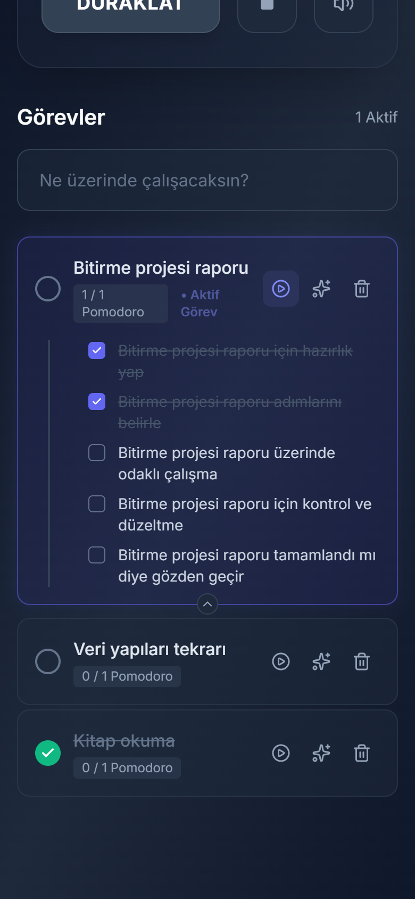

# Odak Noktası

Pomodoro tekniğiyle çalışırken görevleri takip etmeye yarayan bir odaklanma uygulaması. React + TypeScript ile yazıldı, Capacitor ile Android uygulamasına dönüştürüldü.



<p align="center">
  
  &nbsp;
  
</p>

## Ne yapıyor?

- **Odaklan / Kısa Mola / Uzun Mola** (25 / 5 / 15 dk) modları, dairesel ilerleme göstergesi ve tur bitince zil sesi
- **Görev listesi:** ekleme, tamamlama, silme; biten her Pomodoro seçili *aktif göreve* işlenir
- **Alt görevlere bölme:** bir görevi tek dokunuşla adımlara ayırma
- **Günlük başarı** sayacı ve tamamlanan tur sayısına göre değişen motivasyon mesajı
- Telefona ve masaüstüne uyumlu arayüz; Android'de Capacitor ile yerel uygulama olarak çalışır

**Teknolojiler:** React 18 · TypeScript · Vite · Tailwind CSS · Capacitor 7 (Android) · Vitest + Testing Library

## Geliştirme süreci ve AI kullanımı

1. **Prototip: Google AI Studio.** İlk sürümü Google AI Studio'da Gemini ile oluşturdum. O sürümde alt görev önerileri ve motivasyon mesajları Gemini API'sinden geliyordu.
2. **Gerçek bir projeye taşıma: ChatGPT.** AI Studio'nun ürettiği kodu ChatGPT'nin yardımıyla yerelde çalışan bir Vite + npm projesine taşıdım. Capacitor ile Android projesini oluşturdum ve APK'yı telefonumda denedim.
3. **Gemini çağrılarını uygulamadan çıkarma.** Uygulamanın internet olmadan da rahatça kullanılabilmesini istedim. Bu yüzden, yine ChatGPT ile, iki AI özelliğini yerel, kural tabanlı fonksiyonlarla değiştirdim ([`services/assistant.ts`](services/assistant.ts)). Bunun bir güvenlik artısı da oldu: Gemini istekleri doğrudan uygulamanın içinden gittiği için, bu özellikler kalsaydı API anahtarının APK'ya gömülmesi gerekecekti. Artık uygulamada anahtar yok. Fonksiyonlar `async` imzasını koruyor. Böylece LLM ileride bir backend üzerinden, bileşenlere dokunmadan geri eklenebilir.
4. **Claude Code ile kod incelemesi ve test.** Repoyu paylaşmadan önce kodu Claude Code ile inceledim. AI Studio'dan gelen kodda iki hata çıktı (aşağıda). İkisinde de tahminle düzeltmek yerine önce hata yeniden üretildi, sonra düzeltildi. Claude Code ile yapılan commit'lerde bu, `Co-Authored-By: Claude` satırıyla görünüyor.

## Karşılaştığım problemler ve çözümleri

### 1. Her Pomodoro iki kez sayılıyordu

**Belirti:** 25 dakikalık tek bir oturum bitince sayaç `2 tamamlandı`, aktif görev `2 / 1 Pomodoro` gösteriyordu. Süre 00:00'da kaldığı için `BAŞLAT`'a her basış, hiç çalışmadan sayaca 2 daha ekliyordu.

**Kök neden:** Sayaç bir `useEffect` ile yönetiliyordu:

```tsx
useEffect(() => {
  if (isActive && timeLeft > 0) {
    // her saniye timeLeft - 1
  } else if (timeLeft === 0) {
    setIsActive(false);    // isActive değişti → efekt tekrar çalışacak
    handleTimerComplete(); // turu say
  }
}, [isActive, timeLeft]);
```

Süre 0 olunca efekt `setIsActive(false)` çağırıyordu. `isActive` efektin bağımlılıklarından biri olduğu için efekt yeniden çalışıyor, `timeLeft` hâlâ 0 olduğundan `else if` dalına tekrar giriyor ve tur ikinci kez sayılıyordu.

**Doğrulama:** 25 dakika beklemek yerine zaman sahte saatle ileri sarıldı:
- Gerçek tarayıcıda (Playwright'ın sahte saatiyle): tek oturumdan sonra sayaç `2`, ikinci `BAŞLAT`'tan sonra `4` oldu.
- Tam bir oturumu sahte zamanlayıcılarla oynatan bir Vitest regresyon testi yazıldı. Test, düzeltmeden önce `expected '2 tamamlandı' to be '1 tamamlandı'` hatasıyla kırmızıya düştü.

**Çözüm:** Tur artık yalnızca sayaç çalışırken tamamlanıyor ve süre hemen başa sarılıyor:

```tsx
useEffect(() => {
  if (!isActive) return;              // durmuş sayaç hiçbir şeyi tamamlamaz

  if (timeLeft === 0) {
    setIsActive(false);
    setTimeLeft(DEFAULT_TIMES[mode]); // 00:00'da beklemesin
    handleTimerComplete();
    return;
  }
  // her saniye timeLeft - 1
}, [isActive, timeLeft]);
```

Testler artık geçiyor: [`App.test.tsx`](App.test.tsx), commit [`4f48920`](../../commit/4f48920).

### 2. Telefonda görev butonları görünmüyordu

**Belirti:** Android'de görev kartındaki *odaklan*, *alt görevlere böl* ve *sil* butonları görünmüyordu.

**Kök neden:** Butonlar `opacity-0 group-hover:opacity-100` ile yalnızca fare üzerine gelince görünüyordu. Dokunmatik ekranda hover olmadığı için butonlar görünmez kalıyor ama tıklanabilir duruyordu. Alt görev özelliği bulunamıyor, görev yanlışlıkla silinebiliyordu.

**Çözüm:** Küçük ekranlarda butonlar hep görünür, masaüstünde hover davranışı korunuyor (`md:opacity-0 md:group-hover:opacity-100`, commit [`32a4cb0`](../../commit/32a4cb0)).

### 3. Repo düzeni ve güvenlik

- İlk commit'e `node_modules` (5.846 dosya) da girmişti. `.gitignore` ekleyip depodan çıkardım. Build çıktısı `dist/` aynı sebeple hâlâ takip ediliyordu. Onu da `git rm -r --cached` ile takipten çıkardım. API anahtarı yanlışlıkla commit'lenmesin diye `.env` dosyalarını da ignore listesine ekledim.
- AI Studio'dan kalan, React 19'u CDN'den yükleyen `importmap` artık kullanılmıyordu: Vite her şeyi paketliyor ve proje React 18 kullanıyor. Kaldırdım.
- `generateSubtasks` ve `getMotivation` hem bileşenlerin içinde hem de hiç kullanılmayan `geminiService.ts` dosyasında tanımlıydı. Tek serviste birleştirdim ve ChatGPT'den kalan yorumları temizledim.
- `npm audit`'in bildirdiği 9 açığı (1 kritik, 8 yüksek; hepsi geliştirme araçlarında) semver uyumlu güncellemelerle kapattım.

## Bilinen eksikler ve sonraki adımlar

- **Çevrimdışı hedefi yarım kaldı.** Gemini'yi internetsiz kullanım için kaldırdım, ama Tailwind (Play CDN), Inter fontu ve zil sesi hâlâ internetten yükleniyor. Android uygulaması çevrimdışıyken stilsiz açılabilir. → Tailwind'i build'e dahil etmek, fontu ve sesi uygulamayla paketlemek.
- **Veriler kalıcı değil.** Görevler ve sayaç uygulama kapanınca sıfırlanıyor; "Günlük Başarı" da gün değişince sıfırlanmıyor. → `localStorage` / Capacitor Preferences ile saklamak ve tarihe göre sıfırlamak.
- **Arka planda süre kayabilir.** Sayaç her saniye `setInterval` ile azalıyor. Telefon kilitlenince ya da uygulama arka plana alınınca WebView zamanlayıcıları yavaşlatabilir ya da durdurabilir. → Bitiş zamanını saklayıp kalan süreyi ondan hesaplamak, tur bitince yerel bildirim göndermek (Capacitor Local Notifications).
- **Alt görevler şablon tabanlı.** → LLM'i güvenli şekilde geri getirmek: API anahtarını sunucuda tutan küçük bir backend (ör. serverless fonksiyon) ve yapılandırılmış JSON çıktısıyla göreve özel alt görevler üretmek.

## Çalıştırma

Gereksinim: Node.js 24 LTS (veya 22.22+)

```bash
npm install
npm run dev      # http://localhost:5173
npm test         # regresyon testleri
npm run build    # production build → dist/
```

**Android** (Android Studio ve JDK 21 gerekir):

```bash
npm run build
npx cap sync android
npx cap open android   # Android Studio'da açılır, emülatörde veya cihazda çalıştırılır
```

## Proje yapısı

```
App.tsx               Sayaç mantığı ve ana ekran
App.test.tsx          Sayaç için regresyon testleri (Vitest + Testing Library)
components/
  CircularTimer.tsx   SVG dairesel ilerleme göstergesi
  TaskItem.tsx        Görev kartı ve alt görevler
services/
  assistant.ts        Alt görev ve motivasyon üretimi (eski Gemini çağrılarının yerel karşılığı)
types.ts              Tipler ve süre ayarları
capacitor.config.ts   Capacitor ayarları
android/              Capacitor'ın oluşturduğu Android projesi
```
